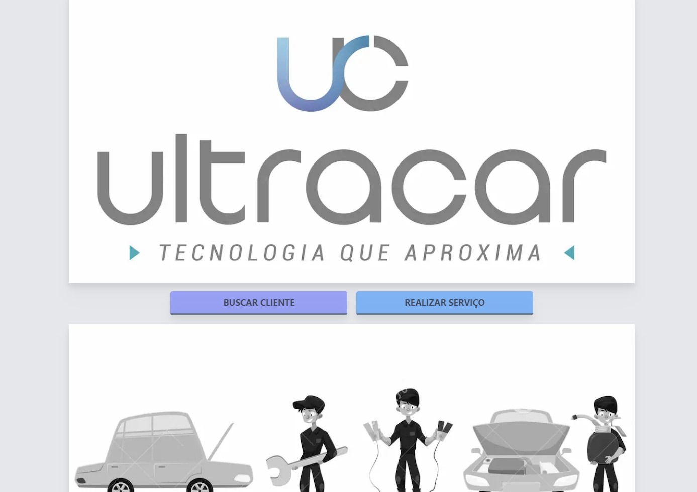
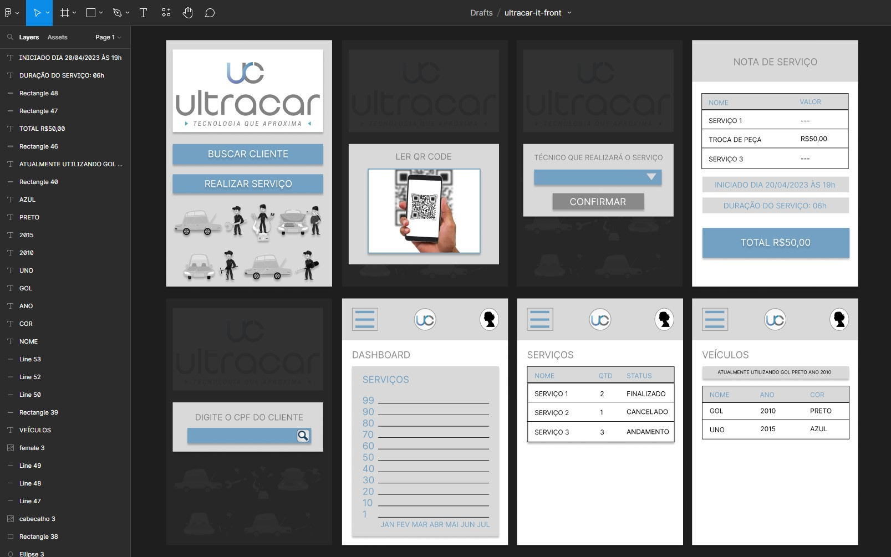

<h1 align="center">Ultracar It Front</h1>

<br>



<br>

<p align="center">Aplicação feita em Nextjs para desafio técnico</p>

<br>

<p align="center">
  
</p>

<br>

<h2 align="center">

[](https://skills.thijs.gg)

</h2>

<br>

### 🎲Objetivo: desenvolver uma aplicação para oficinas mecânicas para que os técnicos possam visualizar os dados dos clientes e detalhamento dos pedidos, além de aceitar o serviço e iniciar o atendimento.</p>

<br>

### Telas no figma, inicio da aplicação:

<br>



<br>

### Technologies

The following tools were used in building this API:

- [Node.js](https://nodejs.org/en/)
- [Javascript]()
- [TypeScript]()
- [Nextjs]()
- [Tailwind.css]()

<br>
<p>
Metodos utilizado:
OOP (Object-Oriented Programming),
Test Driven Development (TDD),
Programação funcional
</p>
<br>

### 🎲 Running the App

```bash
# Install all dependencies
$ npm install

# Build the app and run
$ npm run build
$ npm start

# The server will start on port:3000 - access <http://localhost:3000>
```

<br>
